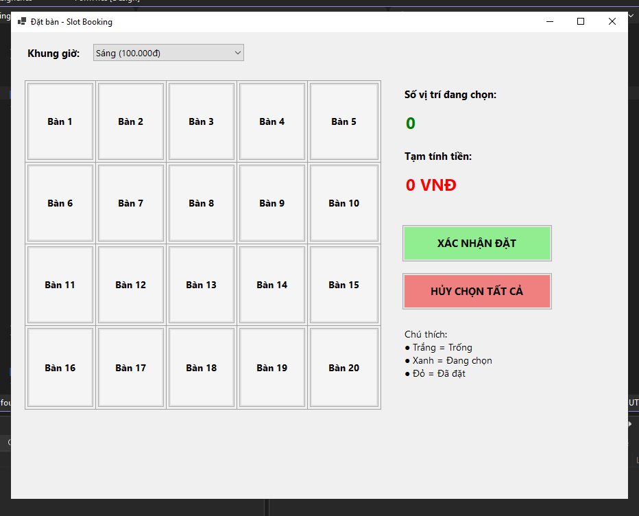
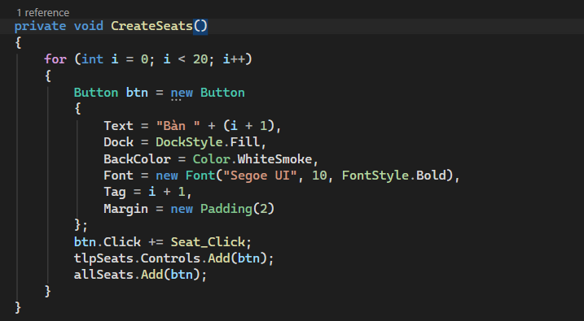
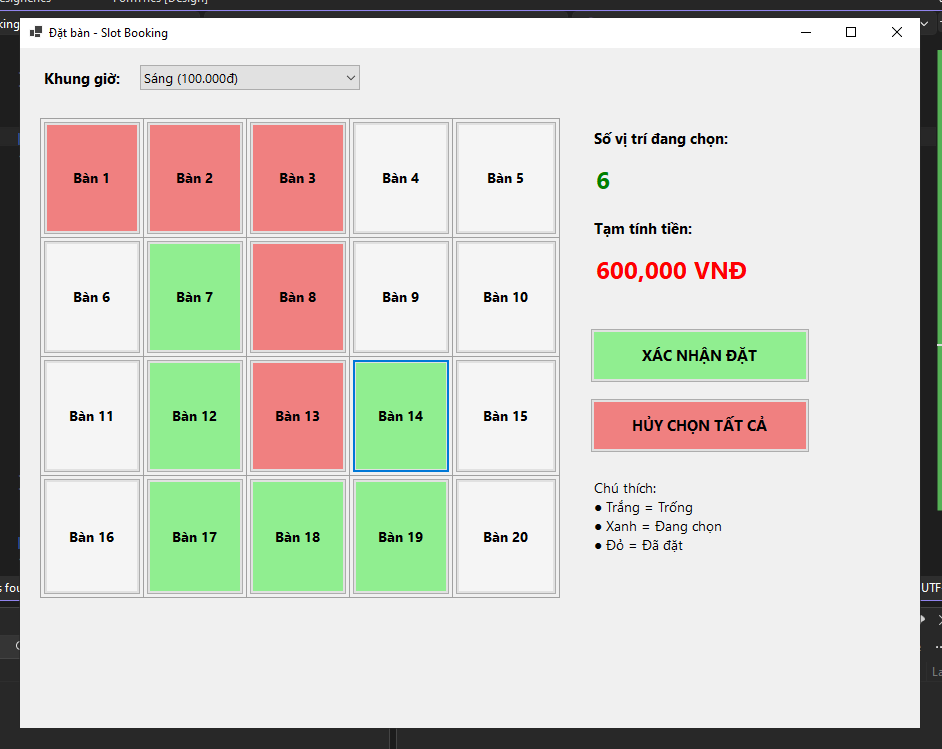
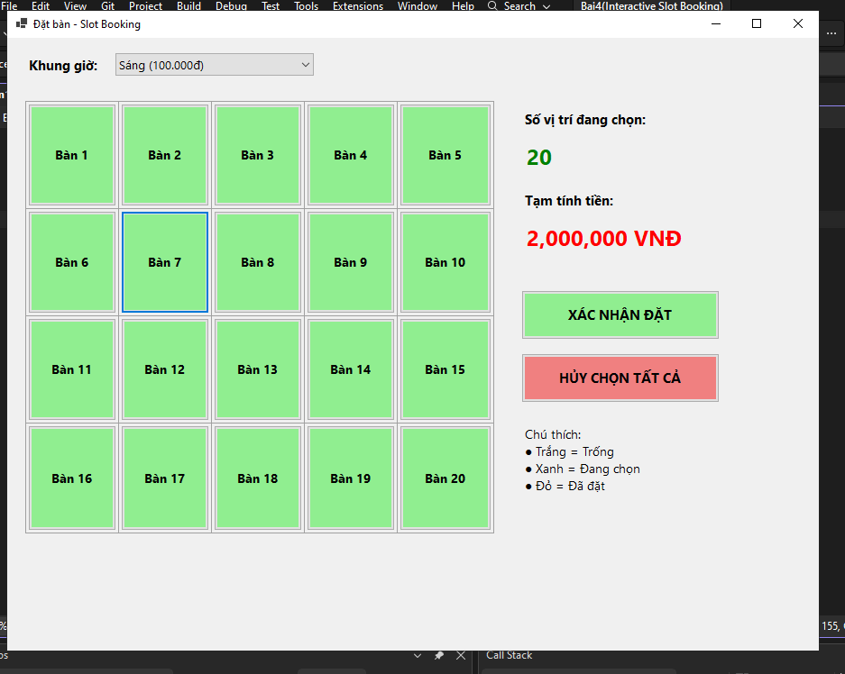
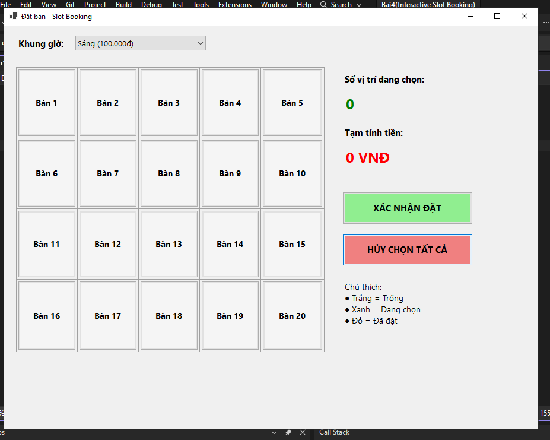

# BÁO CÁO BÀI TẬP

## THÔNG TIN SINH VIÊN
- **Họ và tên: Đặng Cao Thành Đạt**
- **Mã số sinh viên: 24810320215** 
- **Lớp: D19QTANM1** 
- **Tên môn học: Lập Trình.Net** 
- **Tên bài tập: ** 

---

## KẾT QUẢ THỰC HÀNH

### 1. Ảnh màn hình Giao diện chính

### 2. Dùng vòng lặp for để khởi tạo 20 Button vị trí ngay khi Form khởi chạy (Form_Load).

### 3. Quản lý màu sắc trạng thái: Trắng/Xám nhạt (Trống), Xanh lá (Đang chọn), Đỏ (Đã có người đặt / Đã khóa).

### 4. TRƯỚC Gán chung 1 hàm xử lý sự kiện Click cho toàn bộ 20 nút để cập nhật số lượng và tạm tính tiền realtime mỗi khi bấm chọn/bỏ chọn.

### 4. SAU Gán chung 1 hàm xử lý sự kiện Click cho toàn bộ 20 nút để cập nhật số lượng và tạm tính tiền realtime mỗi khi bấm chọn/bỏ chọn.
